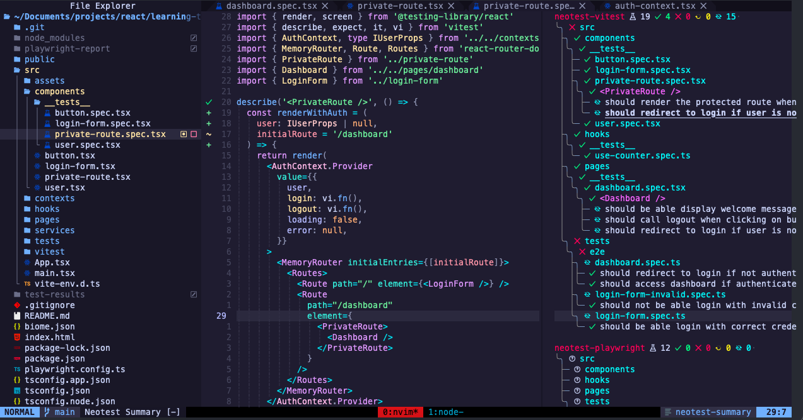

# 🧪 React Testing Project

Este projeto é um estudo prático com foco em **testes automatizados** em aplicações React. Nele exploramos desde testes unitários de componentes até testes de integração e E2E, usando ferramentas modernas e práticas recomendadas.

---

<p align="center">
  
</p>

## 🚀 Tecnologias utilizadas

- [React](https://reactjs.org/) (Vite)
- [TypeScript](https://www.typescriptlang.org/)
- [React Router DOM](https://reactrouter.com/) – Rotas e navegação
- [Vitest](https://vitest.dev/) – Framework de testes unitários
- [Testing Library (React)](https://testing-library.com/docs/react-testing-library/intro/) – Testes de componentes
- [Playwright](https://playwright.dev/) – Testes E2E (End-to-End)
- [MSW (Mock Service Worker)](https://mswjs.io/) *(opcional, mas recomendado)* – Mock de APIs

---

## ✅ Testes Unitários

- LoginForm
- Renderização de inputs
- Submissão de formulário
- Exibição de mensagens de erro
- Comportamento de loading
- Redirecionamento se usuário autenticado
- PrivateRoute
- Redirecionamento automático para /
- Renderização da rota protegida com usuário logado


## 🔒 Testes de Rotas Privadas

Utilizamos o MemoryRouter do React Router para simular navegação e rotas no ambiente de testes, incluindo:

- Redirecionamento automático se o user for null
- Renderização da rota protegida se o usuário estiver autenticado
- Teste de fluxo completo ao acessar o dashboard logado ou não


##🧭 Testes E2E (Playwright)

Utilizamos o Playwright para validar o comportamento da aplicação como um todo, testando:

- Login com credenciais válidas
- Mensagens de erro para login inválido
- Redirecionamentos automáticos
- Logout e retorno para tela de login
- Acesso bloqueado a rotas protegidas sem login


## 🛠️ Boas práticas aplicadas

- Separação clara entre testes unitários e E2E
- Cobertura de cenários de sucesso e falha
- Uso de MemoryRouter e AuthContext em testes
- Simulação de comportamento com vi.fn() (mocks)
- Testes de comportamento, não de implementação
- Isolamento de contexto e renderização por função utilitária
- Testes limpos, legíveis e com nomes descritivos


## 📌 Requisitos para rodar os testes

- Node.js 18+
- Navegadores instalados com: npx playwright install
- Ambiente local ativo servindo a aplicação (npm run dev)
- Dependências instaladas com npm install


## 🧠 Conclusão

Este projeto mostra como testes bem escritos ajudam a garantir qualidade,
evitar regressões e aumentar a confiança em alterações.
A combinação de Testing Library + Playwright oferece 
uma cobertura poderosa e realista para qualquer aplicação React moderna.
Os testes cobrem tanto o comportamento de componentes isolados
quanto o fluxo completo de autenticação, com redirecionamentos e interações reais no navegador.


## 📦 Instalação


```bash
git clone https://github.com/Gui-dev/learning-tests.git

cd learning-tests

npm install
```

```bash

# Executar testes unitários
npm run test
```

```bash

# Instalar Playwright e navegadores
npx playwright install
```

```bash
# Rodar os testes E2E
npx playwright test
```

```bash
# Abrir o modo UI (para debugging visual)
npx playwright test --ui
```


## 📄 Licença

MIT © [Gui Silva]
